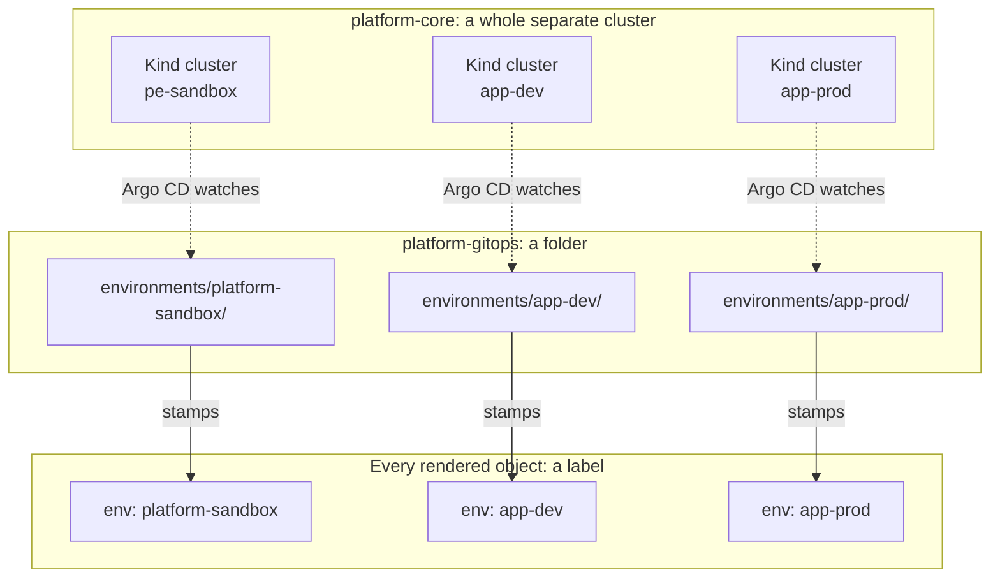

# What is an "environment"?

"Environment" is one of the most overloaded words in software, and this
project uses it in three related but genuinely different ways depending on
which repo you're looking at. If something about environments feels
inconsistent as you read this repo's docs, it's usually because you're
looking at a different layer than the one you were just reading about, not
because something is actually wrong.

## The generic meaning, first

In most software projects, an "environment" is a separate place your
software runs, kept apart from the others so a mistake in one doesn't
affect the rest — commonly `dev`, `staging`, and `prod`. That's the
underlying idea here too. This project has three: `platform-sandbox`,
`app-dev`, and `app-prod`. What differs is *how* "separate" is actually
implemented — and that implementation is different in every repo in this
project.

## The three concrete things this project calls an "environment"

**In `platform-core`, an environment is an entire separate Kubernetes
cluster.** Not a namespace inside one shared cluster — a fully independent
Kind cluster, with its own control plane, its own Docker network, its own
Argo CD installation. `platform-sandbox`, `app-dev`, and `app-prod` are
three completely separate clusters that happen to be running on the same
physical laptop. If `app-prod`'s cluster crashed entirely, `platform-sandbox`
would be completely unaffected — they don't share anything at the
Kubernetes level. This is a deliberately heavier-weight form of isolation
than most projects use, and it's covered in more depth in
[`platform-core`'s own learning companion](../../../platform-core/learning/README.md).

**In `platform-gitops` (this repo), an environment is a folder.** Each
folder under `environments/` corresponds one-to-one with one of those
separate clusters — `environments/platform-sandbox/` is the folder
Argo CD reads when it's running inside the `platform-sandbox` cluster. But
the folder itself is just files sitting in Git; it has no awareness of
clusters, and nothing stops you from looking at it without ever touching a
real cluster at all (that's exactly what
[the getting-started tutorial](../tutorials/getting-started.md) has you do
in its first step).

**Once rendered, an environment becomes a label.** Every object this
repo's Kustomize files produce gets stamped with `env: platform-sandbox`
(or whichever environment it came from), via the `labels:` block in each
environment's root `kustomization.yaml`. This label is what lets you look
at a rendered object, or a real object in a cluster, and know which
environment it belongs to — useful when several environments' worth of
objects might otherwise look identical.

## Why this isn't a mistake worth "fixing"

It might seem cleaner if "environment" meant exactly one thing everywhere.
It doesn't, here, and that's a normal, common shape for a real system: the
same word describes a related concept at each layer, and each layer's
version of the word is the correct one for what that layer actually does.
A cluster is a real, physical thing platform-core provisions. A folder is
how that cluster's desired state is organized in Git. A label is how
Kubernetes lets you tell rendered objects apart. None of the three is a
looser or more correct version of the others — they're three different
tools, each suited to what its own layer needs.

The practical skill worth building is noticing, whenever you read the word
"environment" in this project's docs, which of the three you're actually
looking at — the cluster, the folder, or the label. Once that's automatic,
none of this project's environment-related file layouts will feel
surprising.

See [Add a new environment](../how-to/add-a-new-environment.md) to see all
three layers get created together, in the order they actually have to
happen in.
