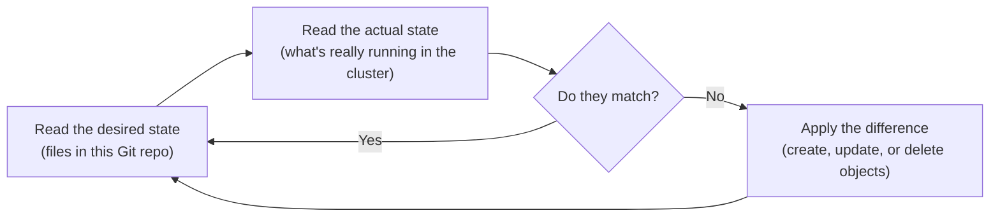

# What is Argo CD, actually

The rest of this repo's documentation assumes you know what Argo CD is and
what "syncing" means. This page exists for anyone who doesn't yet — it
starts from zero.

## The problem GitOps tools like Argo CD solve

Without a tool like this, deploying to Kubernetes usually looks like: a
human or a CI pipeline runs `kubectl apply -f some-file.yaml`, once, at the
moment of deploying. That command runs, finishes, and is done. Nothing is
watching afterward. If someone later runs `kubectl edit` and changes
something by hand, or a bug causes an object to drift from what was
originally applied, nothing notices and nothing corrects it. The cluster's
real state and whatever's written down in a YAML file somewhere can quietly
drift apart, and the only record of what was *supposed* to be running is
whatever's left in someone's shell history or a CI log.

GitOps is a name for a different approach: the source of truth for what
should be running lives in a Git repository (this one, for the objects
`platform-gitops` describes), and a tool continuously makes the real
cluster match it — not just once, at deploy time, but forever, for as long
as the tool keeps running.

## Argo CD's actual job: a loop, not a command

Argo CD is that tool. Once it's installed on a cluster and told which Git
repo and path to watch, it runs a loop that never stops:

This loop is the single most important thing to understand about Argo CD.
It isn't a deploy script that runs once and exits — it's a long-running
process that keeps asking "does reality match what's declared in Git?" and
correcting the answer whenever it doesn't. This is also why a manual
`kubectl edit` against something Argo CD manages doesn't stick: the next
time the loop runs, it notices the live object no longer matches Git, and
reverts it. That specific behavior has a name in this repo's other
files — `selfHeal` — and it's just this loop doing its normal job, not a
special extra feature.

## The vocabulary you'll see everywhere in this repo's docs

- **`Application`** — a Kubernetes object (a custom resource, meaning
  Argo CD extends what kinds of objects Kubernetes understands) that tells
  Argo CD three things: which Git repo to watch, which path or chart
  inside it to use, and where in the cluster to apply the result. Every
  `.yaml` file in this repo's `environments/` tree that has
  `kind: Application` is one of these.
- **Sync status** — whether the live objects in the cluster currently
  match what's declared in Git. `Synced` means they match. `OutOfSync`
  means they don't, for whatever reason — often because something outside
  Argo CD (a webhook, a controller, a person) changed the live object
  after Argo CD applied it.
- **Health status** — a separate question: is the object actually working
  right now, regardless of whether it matches Git byte-for-byte? A pod can
  be `Healthy` and `OutOfSync` at the same time — see
  [this repo's troubleshooting guide](../how-to/troubleshooting.md#argo-cd-shows-the-application-as-outofsync-even-though-nothing-changed)
  for a real example of exactly that.
- **Reconcile** — the act of the loop actually running one pass: comparing
  desired vs. actual state and applying any difference. Argo CD does this
  on its own schedule automatically, but it can also be triggered
  immediately by hand, which several of this project's other repos'
  scripts do to skip the wait during CI.

## Where this fits with everything else in this project

Argo CD itself is installed by a different repo,
[`platform-core`](../../../platform-core/learning/argocd-and-handoff.md),
onto a real Kubernetes cluster. Once installed, it's pointed at *this*
repo — `platform-gitops` — as the first thing to watch. Everything else
this repo's docs cover (tenants, environments, the app-of-apps pattern) is
about what Argo CD finds once it starts reading files here, not about Argo
CD's own mechanics — that's what this page is for.

See [What is an environment?](what-is-an-environment.md) next for the
other piece of vocabulary that trips people up in this project
specifically.
