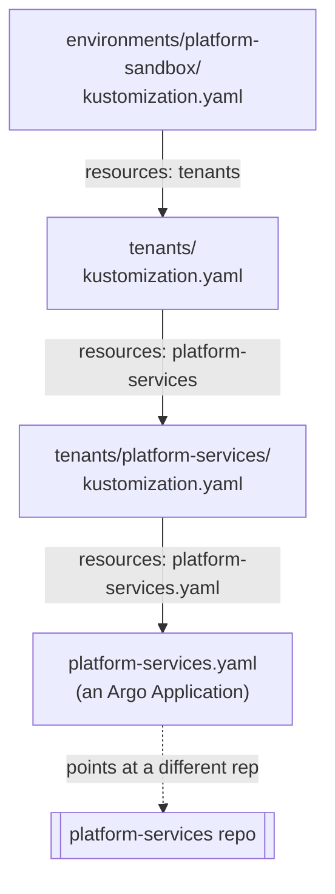

# The App of Apps Pattern

Part of the [platform-gitops learning companion](README.md). Read the
[index](README.md) first for the filing-cabinet analogy this builds on.

---

## Following the chain, one file at a time

Argo CD was paired to this repo with one instruction: watch
`environments/platform-sandbox`. Everything after that is a chain of four
files, each one saying "also look here," until the chain ends at
something that actually deploys a workload.



The first file stamps everything below it with a label and pulls in the
tenants folder:

```yaml
labels:
  - pairs:
      env: platform-sandbox
    includeSelectors: true
    includeTemplates: true

resources:
  - tenants
```

The second file lists which tenants exist in this environment — right now,
just one:

```yaml
resources:
  - platform-services
```

The third file, inside that tenant's own folder, lists what that tenant
actually wants deployed:

```yaml
resources:
  - platform-services.yaml
```

Each of those is a small, boring file, and that's deliberate. Nobody has
to read the whole chain to understand one tenant's setup. Onboarding a
new tenant means adding a folder and one line to the second file — nobody
touches the first file, and no existing tenant's folder changes at all.

## The one file that actually does something

`platform-services.yaml` is where the chain stops being "also look here"
and starts being a real instruction. It's an Argo `Application` object —
the same kind of object `platform-core`'s learning companion already
covered — and it does exactly what that one did: names a different repo
and a path inside it, and tells Argo CD to keep that path's contents
matching the real cluster.

```yaml
apiVersion: argoproj.io/v1alpha1
kind: Application
metadata:
  name: platform-services
  namespace: argocd
spec:
  project: default
  source:
    repoURL: https://github.com/phrankson/platform-services.git
    targetRevision: main
    path: environments/platform-sandbox
  destination:
    server: https://kubernetes.default.svc
    namespace: platform-services
  syncPolicy:
    automated:
      prune: true
      selfHeal: true
```

This is the pattern this whole repo is named after: an **App of Apps**.
The object Argo CD was originally paired to (`platform-gitops` itself) is
an Application whose entire job is producing more Applications — this one
included. Argo CD doesn't need a human to run a command every time a new
tenant or a new piece of platform-services shows up; it discovers each new
Application object the moment this repo's kustomize chain renders it, and
starts managing that one too, automatically.

`selfHeal: true` is worth noticing specifically: if anyone manually
changed something in the cluster that this Application manages — patched a
Deployment directly with `kubectl`, say — Argo CD would quietly revert it
back to match what's declared here, on its own, without anyone asking.
The file is the only place a change is allowed to actually stick.

**Try it yourself** — the whole rendered chain, right now, without
touching Argo CD at all:

```console
$ kubectl kustomize environments/platform-sandbox
apiVersion: argoproj.io/v1alpha1
kind: Application
metadata:
  labels:
    env: platform-sandbox
  name: platform-services
  namespace: argocd
spec:
  destination:
    namespace: platform-services
    server: https://kubernetes.default.svc
  project: default
  source:
    path: environments/platform-sandbox
    repoURL: https://github.com/phrankson/platform-services.git
    targetRevision: main
  syncPolicy:
    automated:
      prune: true
      selfHeal: true
    retry:
      backoff:
        duration: 5s
        maxDuration: 3m
      limit: 5
    syncOptions:
    - CreateNamespace=true
```

And the same object, live inside the actual cluster, being managed by Argo
CD right now:

```console
$ kubectl get application platform-services -n argocd
NAME                SYNC STATUS   HEALTH STATUS
platform-services   Synced        Healthy
```

---

## Where this leads next

`platform-services.yaml` points at one more repo. That repo is where the
chain finally stops pointing at more files and starts actually installing
something real — a service mesh, running Helm charts, on the cluster
`platform-core` built. See
[`platform-services`'s own learning companion](../../platform-services/learning/README.md)
for that half of the story.
